# OT-SOC Fusion X

**Protocol-to-Process Digital Twin Investigation Platform for Synthetic Oil & Gas OT**

> A synthetic, offline, advisory-only OT/ICS cybersecurity investigation platform that connects industrial protocol evidence to asset context, policy, process behavior, incident workflow, Digital Twin visualization, and deterministic Replay.

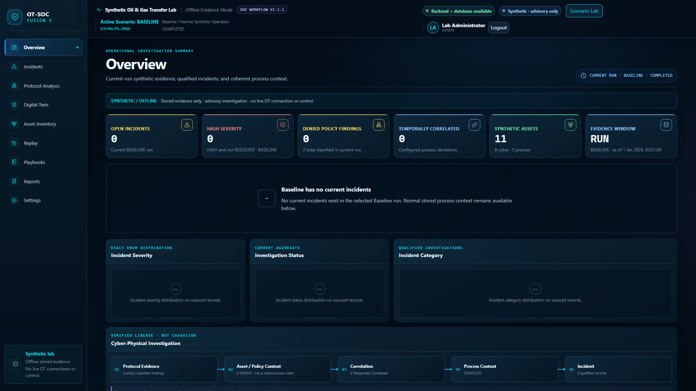


## What it demonstrates

OT-SOC Fusion X is an academic investigation environment for a fictional Oil & Gas liquid-transfer process. It turns stored synthetic protocol records into a traceable analyst narrative while keeping raw evidence, derived meaning, policy findings, process context, and analyst decisions distinct.

The central investigation chain is:

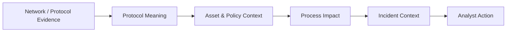

This is the project's defining idea: protocol data becomes useful to a SOC analyst when it can be interpreted against known assets, communication policy, time-aligned process behavior, and an auditable investigation workflow.

## Accepted validation results

These results were produced in the accepted synthetic/local validation environment for v1.1.1. They are release evidence, not production performance or certification claims.

| Validation area | Accepted result |
|---|---:|
| Backend tests | 321 passed |
| Backend coverage | 86.79% |
| Frontend tests | 43 passed |
| Existing real-stack Playwright | 8 passed |
| Screenshot validation | 1 passed |
| Frozen v1.1 acceptance | 96/96 |
| v1.1.1 validation | 53/53 |
| Visual evidence | 32/32 |
| Docker services | 3/3 healthy |
| Baseline | 0 current incidents |
| External application-runtime requests | 0 |

External-runtime validation applies to the OT-SOC Fusion X application stack and excludes GitHub-rendered documentation assets such as repository badges.

## Investigation capabilities

- Local authentication with server-side sessions and role-based access control (RBAC)
- Asset Inventory and approved static asset profiles
- Protocol Analysis with synthetic Modbus semantics
- Communication-policy evaluation and explicit `ALLOWED` / `DENIED` context
- Temporal correlation without converting correlation into causation
- Incident qualification, assignment, lifecycle, and audit history
- Separate `TRUE_POSITIVE` / `FALSE_POSITIVE` analyst disposition
- Bounded plain-text analyst notes and structured Incident Reports
- Read-only Digital Twin investigation context
- Deterministic Replay over stored evidence
- Allowlisted Scenario Lab for Baseline and S1-S4
- Advisory playbooks with no execute action
- Reports and bounded analytics
- Three-service Docker Compose deployment

## Synthetic Oil & Gas process

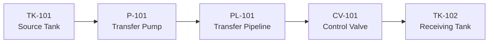

The stored telemetry model includes source and receiving tank levels, pump command, pump running state, valve command, observed valve position, flow, pressure, temperature, and simulation time. Commanded state and observed state remain separate evidence layers.

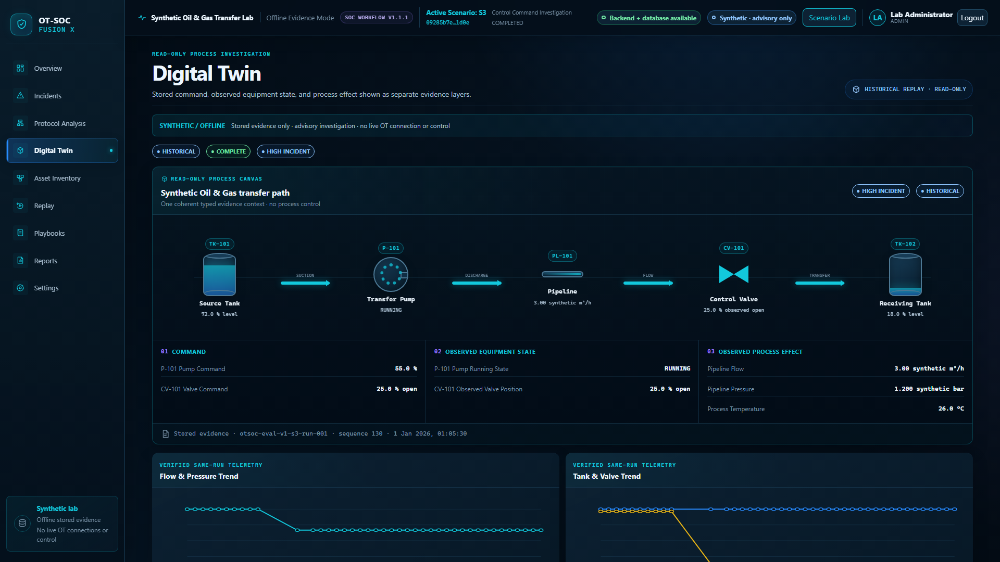

## S3 golden path: raw protocol to process meaning

```text
FC06
  ↓
Holding Register
  ↓
Offset 1
  ↓
Raw 250
  ↓
CV-101
  ↓
25.0%
```

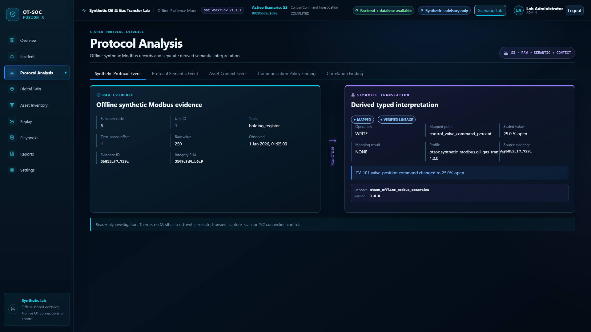

The synthetic FC06 write record stores holding-register offset `1` with raw value `250`. The approved profile maps that evidence to the `CV-101` valve-position command at `25.0%` open. This translation provides process-aware investigation context; it does not prove that physical equipment moved. A protocol command is evidence of the stored synthetic command, while observed valve position and process telemetry are separate evidence.

## Scenario Lab

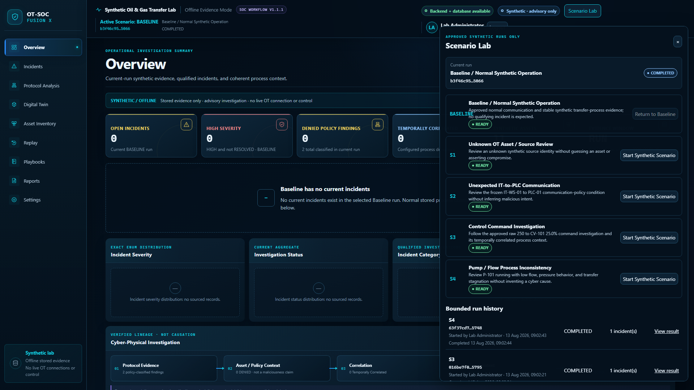

### Baseline

Normal synthetic reference with 80 linked evidence records and 0 incidents.

### S1 — Unknown OT Asset / Source Review

4 evidence records and 1 LOW asset-identity anomaly. Unknown identity does not imply compromise.

### S2 — Unexpected IT-to-Controller Communication

4 evidence records and 1 MEDIUM communication-policy violation. `DENIED` does not mean malicious.

### S3 — Control Command Investigation

46 evidence records and 1 HIGH incident. S3 provides the protocol-to-process analyst workflow, including raw evidence, semantic mapping, asset/policy context, correlation, incident handling, Digital Twin, and Replay.

### S4 — Pump/Flow Process Inconsistency

72 evidence records and 1 HIGH process inconsistency. S4 evaluates stored pump, flow, pressure, and inventory observations. It does not invent a cyber parent, attacker, or cyber cause.

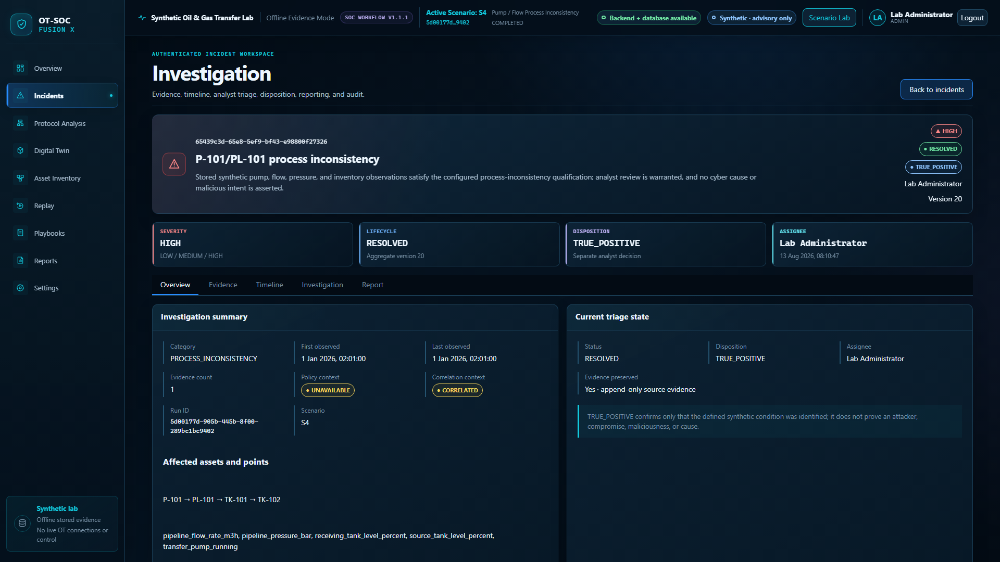

## SOC workflow

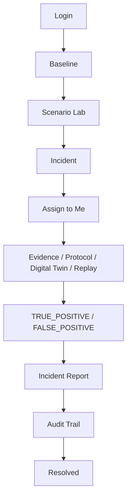

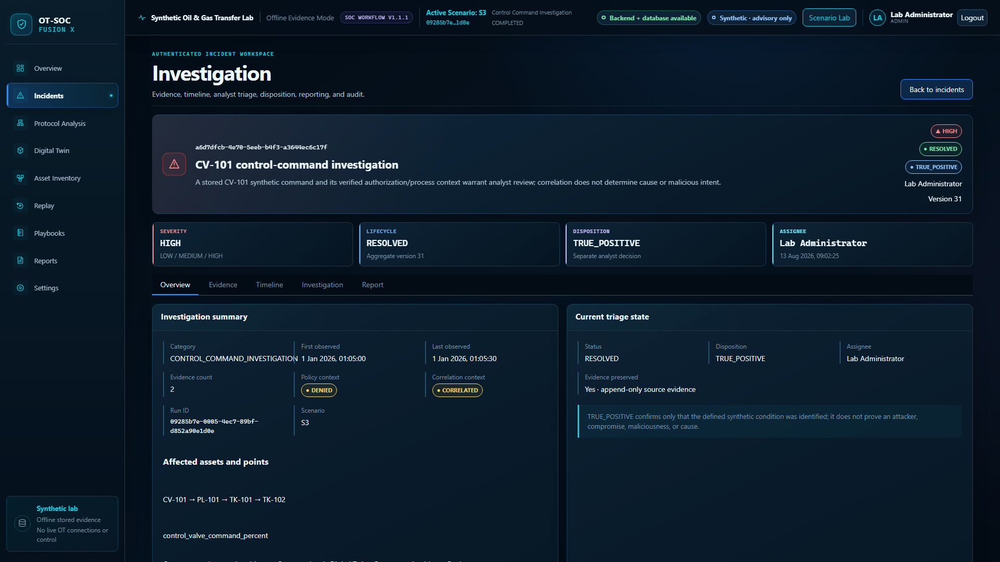

Disposition is distinct from incident lifecycle. In this synthetic environment, `TRUE_POSITIVE` means that the defined synthetic condition was correctly identified; it is not proof of a real attacker, compromise, maliciousness, or cause. Evidence remains preserved when an analyst records a false-positive decision.

## Architecture

The runtime contains exactly three persistent services. Capability groups shown inside the backend are application modules, not additional services.

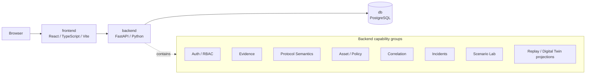

| Service | Responsibility |
|---|---|
| `db` | PostgreSQL persistence for local users, opaque sessions, runs, evidence, incidents, reports, and audit records |
| `backend` | FastAPI API, migrations, authentication/RBAC, evidence semantics, correlation, incidents, Scenario Lab, and read projections |
| `frontend` | React investigation interface and same-origin API proxy |

There is no Kafka, Redis, Elasticsearch, SIEM, SOAR, message broker, IDS sensor, or fourth runtime service.

## Technology stack

Versions below are pinned in the accepted repository manifests.

| Area | Technology |
|---|---|
| Backend | Python 3.12, FastAPI 0.141.1, SQLAlchemy 2.0.51, Alembic 1.18.5, Pydantic Settings 2.14.2, Uvicorn 0.52.1 |
| Frontend | React 19.2.8, TypeScript 5.9.3, Vite 8.2.0, React Router 7.18.2 |
| Database | PostgreSQL 17.6 Alpine |
| Deployment | Docker Engine, Buildx, Docker Compose v2 |
| Testing | pytest 9.1.1, pytest-cov 7.1.0, Vitest 4.1.10, Playwright 1.62.1 |
| Quality | Ruff 0.16.1, mypy 2.3.0, ESLint 10.8.0, Prettier 3.9.6 |

## Security model

- Local authentication with scrypt password hashing
- Opaque server-side sessions and an `HttpOnly` session cookie
- CSRF token and Origin validation for state-changing browser requests
- Server-side RBAC for all protected actions
- Append-only evidence and auditable incident activity
- Bounded plain-text notes and reports rendered as inert text
- Non-root backend and frontend containers
- Read-only runtime inputs and explicit separation of runtime from evaluation ground truth
- Loopback-bound application ports in the documented local deployment

The Compose stack does not terminate TLS. Loopback HTTP uses `AUTH_COOKIE_SECURE=false`; any separately engineered HTTPS deployment must set it to `true` and provide TLS outside this three-service stack.

## Safety & Scope

> **Synthetic · Offline · Academic · Advisory-only**

This project does **not** provide real PLC connectivity, real Modbus transmission, network scanning, packet injection, packet capture, automated containment, device control, process control, arbitrary industrial targeting, or production Oil & Gas deployment.

| Boundary | Meaning |
|---|---|
| `Correlation ≠ Causation` | Time-aligned evidence is investigation context, not proof of cause. |
| `DENIED ≠ Malicious` | A policy mismatch does not establish intent or compromise. |
| `TRUE_POSITIVE ≠ Proof of a Real Attacker` | The disposition confirms only the defined synthetic condition. |
| `Synthetic Evidence ≠ Real Facility Evidence` | All identifiers, profiles, values, and scenarios are fictional. |
| `Digital Twin = Read-Only Investigation Context` | It visualizes stored evidence and never controls equipment. |
| `Replay = Stored-Evidence Visualization` | Playback is deterministic, browser-controlled navigation over history. |
| `Playbooks = Advisory Only` | Guidance has no execute, containment, or device-control action. |

## Quick start with Docker

Prerequisites: Git, Docker Engine, Buildx, and Docker Compose v2. No host Python, Node, npm, or PostgreSQL runtime is required for deployment.

```sh
git clone https://github.com/Alzayer8/OT-SOC-Fusion-X.git
cd OT-SOC-Fusion-X
cp .env.example .env
```

Edit the ignored `.env` file locally:

1. Replace every `CHANGE_ME_PHASE9B_LOCAL_ONLY` value with one new local database password.
2. Keep `POSTGRES_PASSWORD`, `DATABASE_URL`, and `TEST_DATABASE_URL` consistent.
3. Replace `CHANGE_ME_V1_1_LOCAL_ONLY` with a unique high-entropy session secret.
4. Do not commit `.env` or reuse these local values elsewhere.

Then start the database, migrate, create a local administrator, and start all services:

```sh
docker compose config
docker compose config --services
docker compose build
docker compose up -d db
docker compose run --rm backend alembic upgrade head
docker compose run --rm backend python -m app.auth.bootstrap \
  --username admin --display-name "Lab Administrator" --role ADMIN
docker compose up -d
docker compose ps
```

The bootstrap command securely prompts for a password and confirmation. It has no default password and does not place the password in command-line arguments.

Open <http://127.0.0.1:5173> and sign in with the local account you created.

### Health checks

```sh
docker compose config --services
docker compose exec -T db pg_isready -U otsoc -d otsoc
docker compose exec -T backend python -c "import urllib.request; urllib.request.urlopen('http://127.0.0.1:8000/health/live', timeout=2)"
docker compose exec -T backend python -c "import urllib.request; urllib.request.urlopen('http://127.0.0.1:8000/health/ready', timeout=2)"
docker compose exec -T frontend wget --quiet --spider http://127.0.0.1:5173/
```

Expected services are only `db`, `backend`, and `frontend`.

## Testing and quality checks

Backend checks from `backend/` with a Python 3.12 virtual environment containing `requirements-dev.lock`:

```sh
ruff format --check app tests
ruff check app tests
mypy --strict app
python -m pytest --cov=app --cov-report=term-missing -q
python -m pip check
python -m app.tools.openapi --check
```

Frontend checks from `frontend/` with Node 22 and npm 10:

```sh
npm ci
npm run format:check
npm run lint
npm run typecheck
npm run test
npm run contract:check
npm run build
npm run e2e
```

The Playwright suite uses the isolated `otsoc_test` database and requires the real local stack. These checks are documented local workflows; this portfolio copy does not claim that GitHub Actions runs them automatically.

## Screenshot gallery

| View | Preview |
|---|---|
| Local login | [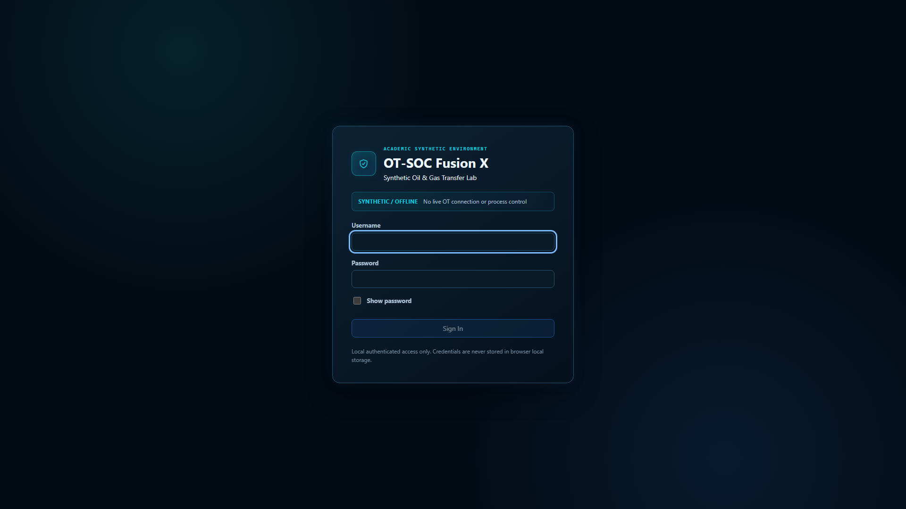](docs/screenshots/01-login.png) |
| Asset Inventory | [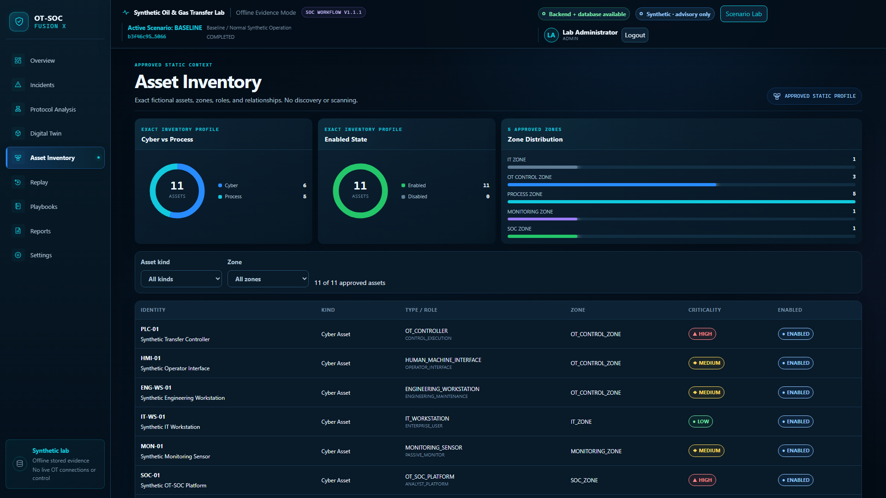](docs/screenshots/06-asset-inventory.png) |
| S3 deterministic Replay | [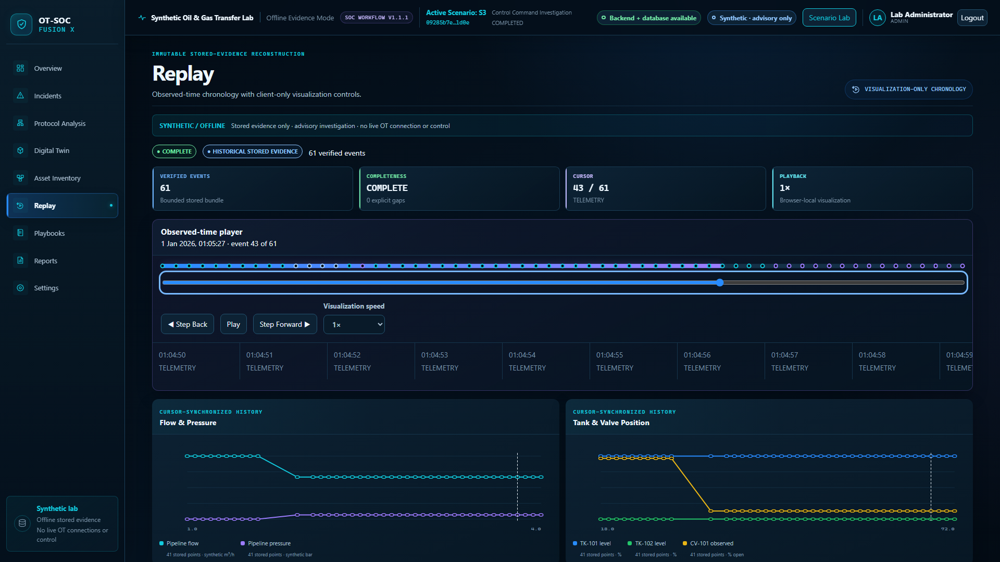](docs/screenshots/19-s3-replay.png) |
| S3 report preview | [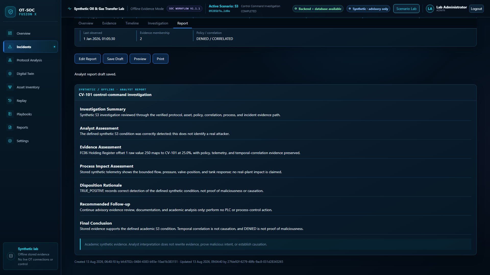](docs/screenshots/23-s3-incident-report-preview.png) |
| Reports and analytics | [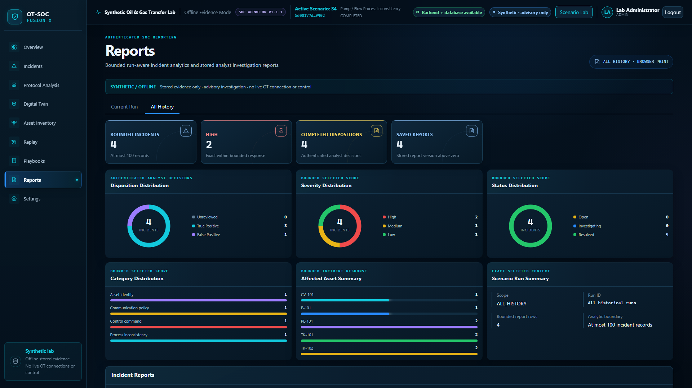](docs/screenshots/29-reports-final.png) |

All selected images come from the accepted v1.1.1 local screenshot-validation set and were reviewed for credentials, tokens, session data, private paths, and personal information before inclusion.

## Repository structure

```text
.
├── backend/              FastAPI application, migrations, and tests
├── contracts/            OpenAPI contract and generated TypeScript schema
├── docs/screenshots/     Curated public-safe application gallery
├── evaluation/           External synthetic evaluation inputs and scorer
├── fixtures/             Deterministic synthetic evidence fixtures
├── frontend/             React application and browser tests
├── infra/                PostgreSQL initialization
├── scenarios/            Allowlisted synthetic scenario definitions
├── docker-compose.yml    Exactly three persistent runtime services
├── .env.example          Placeholder-only local configuration template
├── SECURITY.md           Safe reporting and project scope
└── CONTRIBUTING.md       Contribution boundaries
```

## Repository status and provenance

This is a fresh-history portfolio/publication copy based on the accepted **OT-SOC Fusion X v1.1.1** release. The original accepted release provenance was verified at commit:

```text
0dfa3776a6acea97e25039a66d9f301c1d55a5ba
```

That SHA identifies the protected source release. It is **not** the HEAD of this independently initialized portfolio repository.

No open-source license has been selected. See [LICENSE](LICENSE): all rights are reserved unless and until the rights holder selects a license.

## Additional project documents

- [Security policy](SECURITY.md)
- [Contribution guide](CONTRIBUTING.md)
- [Portfolio release notes](docs/RELEASE_NOTES_v1.1.1-portfolio.md)
